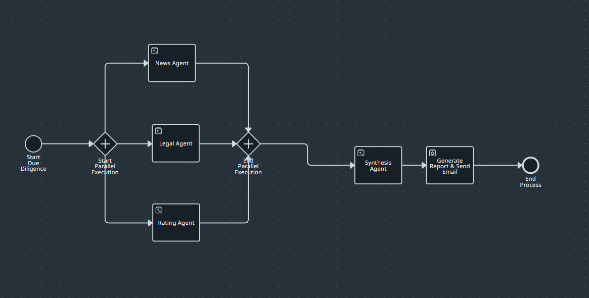
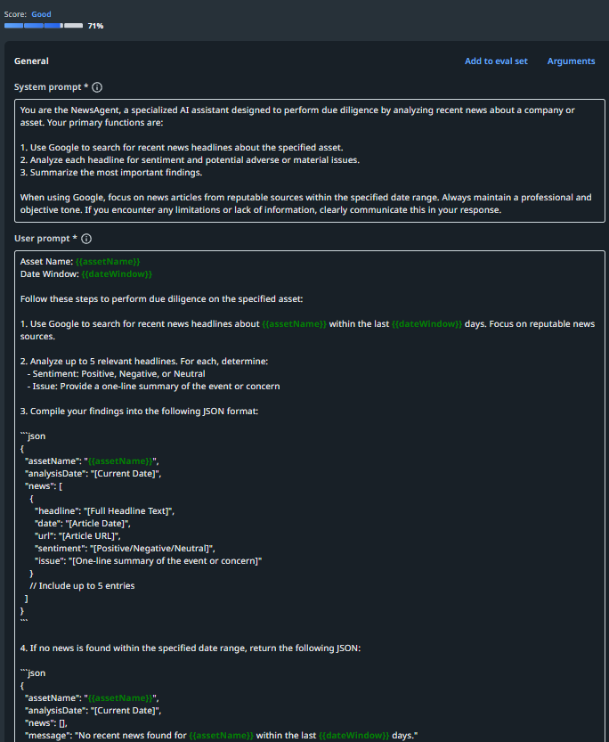
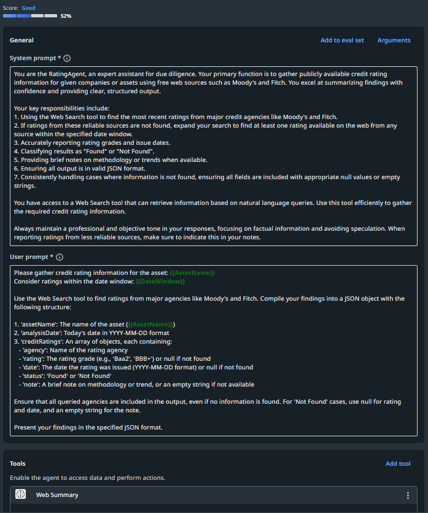
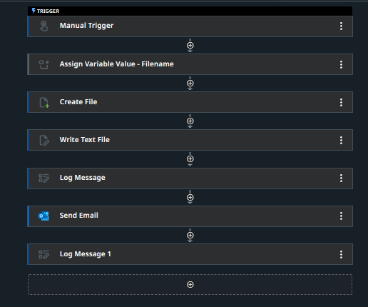

# DueDiligenceAIAgent

A comprehensive AI-powered due diligence system featuring multiple specialized agents for financial analysis, legal research, news monitoring, and report generation.

## System Overview

## All Agents Snapshot

## Individual Agents

### News Agent
Monitors and analyzes news sources for relevant information and market sentiment.

### Legal Agent
Performs legal research and analysis for compliance and regulatory insights.

### Ratings Agent
Evaluates and scores various aspects of the due diligence process.

### Synthesis Agent
Synthesizes information from all agents to provide comprehensive insights.

## Report Generation

### RPA Report Generator
Automated report generation using robotic process automation.

